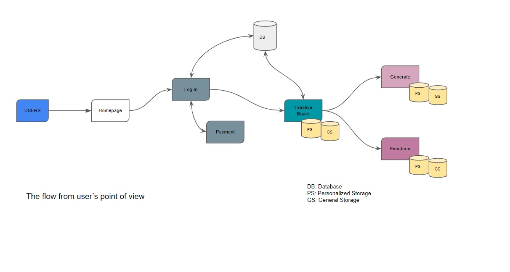

# Stable Diffusion x Crypto Project 

## Background
Creative art has been a feature of human intelligence since the dawn of humanity. It has been a prominent feature used in conveying world-shifting ideas throughout history. Recently, Artificial Intelligence in arts has seen a massive explosion. Today, models such as GPT-3 and Stable Diffusion produce writings and art that impress even the most creative writers and artists. We believe integrating such models in writers’ and artists’ workflow could enhance their productivity and creativity. 

## Scope
In this project, we would like to explore creating a workflow for writers and artists to include state-of-the-art creative models to assist, complement and enhance their creative work. Apart from having a pipeline for different SOTA models, the project will create a marketplace for fine-tuning models on top of SOTA models and prompts.

## Eventual App Design 

## Sub-project Status
### Front-end
- [x] POC design using Stramlit
- [ ] Authentication 
- [ ] Payment gatway
- [ ] App design using modern front-end framework
- [ ] integration with a database

### AI/ML Pipeline
- [x] FastAPI for API
- [x] Huggingface and PyTorch integration
- [x] Generate images
- [ ] Introduce new concepts using textual inversion
- [ ] Introduce new concepts using textual inversion and prior preservation
- [ ] ImageToImage pipeline
- [ ] Image Inpainting

### Dev-ops

- [ ] Basic deployment architecture
- [ ] General storage for all users
- [ ] Includes all base SOTA models
- [ ] Personalized storage that contains fine-tuned model/images  

## How to deploy the current prototype
### Requirments
- GPU (at least 16GB RAM)
- Docker
- Docker-compose

### Steps to deploying prototype
1. `git clone` this repo
2. `cd` into the project folder
3. `docker-compose up --build` to launch the project

## Tools Survey
As part of this project, we are collating different tools the community use. Please feel free to add to this list.

**Front-End Framework**
- React

**API**
- FastAPI

**ML Framework**
- PyTorch
- Huggingface

**DevOps**
- Kubernettes

**Database**
- PostgreSQL

**Cloud Provider**
- Vast.ai
- Banana.dev
- AWS

**Authentication Tool**
- 

**Payment Gateway**
- 

## How to join the project?

